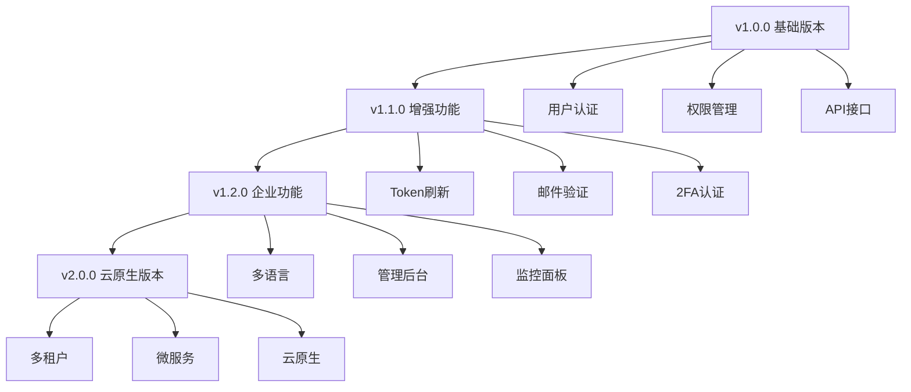

# SA-Token 登录认证系统

<div align="center">


一个基于 Spring Boot 3 和 SA-Token 的现代化登录认证系统

[功能特性](#-功能特性) • [快速开始](#-快速开始) • [API文档](#-api文档) • [测试](#-测试) • [部署](#-部署)

</div>

## 📋 目录

- [项目简介](#-项目简介)
- [功能特性](#-功能特性)
- [技术栈](#-技术栈)
- [项目结构](#-项目结构)
- [快速开始](#-快速开始)
- [配置说明](#-配置说明)
- [API文档](#-api文档)
- [测试](#-测试)
- [部署](#-部署)
- [贡献指南](#-贡献指南)
- [许可证](#-许可证)

## 🚀 项目简介

SA-Token 登录认证系统是一个基于 Spring Boot 3 和 SA-Token 框架构建的现代化用户认证解决方案。该项目提供了完整的用户注册、登录、权限管理功能，具有高性能、易扩展、安全可靠的特点。

### 🎯 设计目标

- **简单易用**: 提供简洁的API接口，降低集成成本
- **安全可靠**: 采用现代化的安全机制，保护用户数据
- **高性能**: 优化的架构设计，支持高并发访问
- **易扩展**: 模块化设计，便于功能扩展和定制

## ✨ 功能特性

### 🔐 认证功能
- ✅ 用户注册与登录
- ✅ JWT Token 生成与验证
- ✅ 登录状态检查
- ✅ 安全注销
- ✅ 多端登录支持
- ✅ 会话管理

### 👥 用户管理
- ✅ 用户信息CRUD操作
- ✅ 用户名/邮箱/手机号唯一性验证
- ✅ 逻辑删除机制
- ✅ 用户状态管理

### 🛡️ 权限控制
- ✅ 基于角色的权限控制(RBAC)
- ✅ 细粒度权限管理
- ✅ 注解式权限验证
- ✅ 动态权限分配

### 🔒 安全特性
- ✅ 密码加密存储(SHA-256 + 盐值)
- ✅ 参数验证与防护
- ✅ SQL注入防护
- ✅ XSS攻击防护

### 📊 监控与日志
- ✅ 操作日志记录
- ✅ 登录状态监控
- ✅ 异常处理机制

## 🛠️ 技术栈

### 后端技术
- **Java 21** - 编程语言
- **Spring Boot 3.4.7** - 应用框架
- **SA-Token 1.44.0** - 认证授权框架
- **Spring Data JPA** - 数据访问层
- **MyBatis 3.0.4** - 持久层框架
- **MySQL 8.0** - 数据库
- **Lombok** - 代码简化工具

### 开发工具
- **Maven** - 项目构建工具
- **JUnit 5** - 单元测试框架
- **Mockito** - Mock测试框架
- **H2 Database** - 测试数据库

## 📁 项目结构

```
sa-token-demo/
├── src/
│   ├── main/
│   │   ├── java/com/viper/demo/
│   │   │   ├── Config/              # 配置类
│   │   │   │   ├── DataInitializer.java
│   │   │   │   └── StpInterfaceImpl.java
│   │   │   ├── Controller/          # 控制器层
│   │   │   │   ├── AuthController.java
│   │   │   │   └── UserController.java
│   │   │   ├── Mapper/              # MyBatis映射器
│   │   │   ├── Pojo/                # 实体类和DTO
│   │   │   │   ├── User.java
│   │   │   │   ├── Result.java
│   │   │   │   ├── LoginRequest.java
│   │   │   │   └── RegisterRequest.java
│   │   │   ├── Repository/          # JPA数据访问层
│   │   │   │   └── UserRepository.java
│   │   │   ├── Service/             # 业务逻辑层
│   │   │   │   ├── UserService.java
│   │   │   │   └── Impl/
│   │   │   │       └── UserServiceImpl.java
│   │   │   ├── Utils/               # 工具类
│   │   │   │   └── PasswordUtil.java
│   │   │   └── SaTokenDemoApplication.java
│   │   └── resources/
│   │       ├── application.properties
│   │       └── application-prod.properties
│   └── test/                        # 测试代码
│       ├── java/com/viper/demo/
│       │   ├── Controller/          # 控制器测试
│       │   ├── Service/             # 服务层测试
│       │   ├── Repository/          # 数据访问层测试
│       │   ├── Utils/               # 工具类测试
│       │   ├── Pojo/                # 实体类测试
│       │   ├── Config/              # 配置类测试
│       │   └── Integration/         # 集成测试
│       └── resources/
│           └── application-test.properties
├── docs/                            # 文档目录
│   ├── API_DOCUMENTATION.md
│   ├── TEST_DOCUMENTATION.md
│   ├── TEST_SUMMARY.md
│   └── TESTING_COMPLETE.md
├── run-tests.sh                     # 测试运行脚本
├── pom.xml                          # Maven配置文件
└── README.md                        # 项目说明文档
```

## 🚀 快速开始

### 环境要求

- **Java**: 21+
- **Maven**: 3.6+
- **MySQL**: 8.0+
- **IDE**: IntelliJ IDEA / Eclipse

### 1. 克隆项目

```bash
git clone <repository-url>
cd sa-token-demo
```

### 2. 数据库配置

创建MySQL数据库：

```sql
CREATE DATABASE sa_token_demo CHARACTER SET utf8mb4 COLLATE utf8mb4_unicode_ci;
```

### 3. 配置文件

修改 `src/main/resources/application.properties`：

```properties
# 数据库配置
spring.datasource.url=jdbc:mysql://localhost:3306/sa_token_demo
spring.datasource.username=your_username
spring.datasource.password=your_password

# SA-Token配置
sa-token.token-name=satoken
sa-token.timeout=2592000
sa-token.active-timeout=-1
sa-token.is-concurrent=true
sa-token.is-share=false
sa-token.token-style=uuid
```

### 4. 运行项目

```bash
# 编译项目
./mvnw clean compile

# 运行项目
./mvnw spring-boot:run
```

### 5. 验证安装

访问 `http://localhost:9191`，项目启动成功后会自动创建以下测试用户：

| 用户名 | 密码   | 角色  | 邮箱              |
|--------|--------|-------|-------------------|
| admin  | 123456 | admin | admin@example.com |
| test   | 123456 | user  | test@example.com  |

## ⚙️ 配置说明

### 应用配置

```properties
# 应用基本配置
spring.application.name=sa-token-demo
server.port=9191

# 数据库配置
spring.datasource.driver-class-name=com.mysql.cj.jdbc.Driver
spring.jpa.hibernate.ddl-auto=update
spring.jpa.show-sql=true

# SA-Token配置
sa-token.token-name=satoken          # Token名称
sa-token.timeout=2592000             # Token有效期(秒)
sa-token.active-timeout=-1           # Token临时有效期
sa-token.is-concurrent=true          # 是否允许同一账号并发登录
sa-token.is-share=false              # 在多人登录同一账号时，是否共用一个token
sa-token.token-style=uuid            # Token风格
```

### 环境配置

项目支持多环境配置：

- `application.properties` - 默认配置
- `application-dev.properties` - 开发环境
- `application-test.properties` - 测试环境  
- `application-prod.properties` - 生产环境

## 📖 API文档

### 认证相关接口

#### 用户登录
```http
POST /auth/login
Content-Type: application/json

{
    "username": "admin",
    "password": "123456"
}
```

#### 用户注册
```http
POST /auth/register
Content-Type: application/json

{
    "username": "newuser",
    "password": "123456",
    "email": "newuser@example.com",
    "phone": "13800138000"
}
```

#### 检查登录状态
```http
GET /auth/isLogin
```

#### 获取用户信息
```http
GET /auth/userInfo
Authorization: satoken <token>
```

#### 用户注销
```http
POST /auth/logout
Authorization: satoken <token>
```

### 用户管理接口

#### 获取用户个人信息
```http
GET /user/profile
Authorization: satoken <token>
```

#### 更新用户信息
```http
PUT /user/profile
Authorization: satoken <token>
Content-Type: application/json

{
    "email": "newemail@example.com",
    "phone": "13800138999"
}
```

#### 获取用户列表（管理员）
```http
GET /user/list
Authorization: satoken <admin_token>
```

#### 获取用户权限信息
```http
GET /user/permissions
Authorization: satoken <token>
```

### 响应格式

所有API响应都遵循统一格式：

```json
{
    "code": 200,
    "message": "success",
    "data": {
        // 响应数据
    }
}
```

**状态码说明**：
- `200`: 成功
- `400`: 请求参数错误
- `401`: 未登录或登录失败
- `403`: 权限不足
- `404`: 资源不存在
- `500`: 服务器内部错误

详细API文档请参考：[API_DOCUMENTATION.md](docs/API_DOCUMENTATION.md)

## 🧪 测试

项目包含完整的测试体系，覆盖所有核心功能。

### 测试统计

| 测试类型 | 文件数 | 测试方法数 | 代码行数 |
|---------|-------|-----------|----------|
| 单元测试 | 10 | 163 | 2631 |
| 集成测试 | 1 | 10 | 285 |
| **总计** | **11** | **173** | **2916** |

### 运行测试

```bash
# 运行所有测试
./mvnw test

# 运行特定测试类
./mvnw test -Dtest=UserServiceTest

# 运行测试并生成覆盖率报告
./mvnw test jacoco:report

# 使用测试脚本（交互式）
chmod +x run-tests.sh
./run-tests.sh
```

### 测试覆盖

- ✅ **单元测试**: 所有Service、Controller、Utils类
- ✅ **集成测试**: 完整的认证流程
- ✅ **数据层测试**: Repository层测试
- ✅ **Web层测试**: MockMvc测试
- ✅ **异常测试**: 边界条件和异常处理

详细测试文档请参考：[TEST_DOCUMENTATION.md](docs/TEST_DOCUMENTATION.md)

## 🚢 部署

### Docker部署

创建 `Dockerfile`：

```dockerfile
FROM openjdk:21-jdk-slim

WORKDIR /app

COPY target/demo-0.0.1-SNAPSHOT.jar app.jar

EXPOSE 9191

ENTRYPOINT ["java", "-jar", "app.jar"]
```

1. 构建镜像：
```bash
./mvnw clean package -DskipTests
docker build -t sa-token-demo .
```

2. 运行容器：
```bash
docker run -d \
  --name sa-token-demo \
  -p 9191:9191 \
  -e SPRING_PROFILES_ACTIVE=prod \
  -e SPRING_DATASOURCE_URL=jdbc:mysql://host:3306/sa_token_demo \
  -e SPRING_DATASOURCE_USERNAME=username \
  -e SPRING_DATASOURCE_PASSWORD=password \
  sa-token-demo
```

### Docker Compose部署

创建 `docker-compose.yml`：

```yaml
version: '3.8'

services:
  mysql:
    image: mysql:8.0
    container_name: sa-token-mysql
    environment:
      MYSQL_ROOT_PASSWORD: root123
      MYSQL_DATABASE: sa_token_demo
      MYSQL_USER: sa_token
      MYSQL_PASSWORD: sa_token123
    ports:
      - "3306:3306"
    volumes:
      - mysql_data:/var/lib/mysql
    networks:
      - sa-token-network

  app:
    build: .
    container_name: sa-token-app
    depends_on:
      - mysql
    environment:
      SPRING_PROFILES_ACTIVE: prod
      SPRING_DATASOURCE_URL: jdbc:mysql://mysql:3306/sa_token_demo
      SPRING_DATASOURCE_USERNAME: sa_token
      SPRING_DATASOURCE_PASSWORD: sa_token123
    ports:
      - "9191:9191"
    networks:
      - sa-token-network

volumes:
  mysql_data:

networks:
  sa-token-network:
    driver: bridge
```

运行：
```bash
docker-compose up -d
```

### 传统部署

1. 打包项目：
```bash
./mvnw clean package -DskipTests
```

2. 运行JAR包：
```bash
java -jar target/demo-0.0.1-SNAPSHOT.jar \
  --spring.profiles.active=prod \
  --spring.datasource.url=jdbc:mysql://localhost:3306/sa_token_demo \
  --spring.datasource.username=username \
  --spring.datasource.password=password
```

### 生产环境配置

创建 `application-prod.properties`：

```properties
# 生产环境配置
spring.jpa.show-sql=false
spring.jpa.hibernate.ddl-auto=validate
logging.level.com.viper.demo=INFO
sa-token.is-log=false

# 性能优化
spring.jpa.properties.hibernate.jdbc.batch_size=20
spring.jpa.properties.hibernate.order_inserts=true
spring.jpa.properties.hibernate.order_updates=true
spring.jpa.properties.hibernate.jdbc.batch_versioned_data=true

# 连接池配置
spring.datasource.hikari.maximum-pool-size=20
spring.datasource.hikari.minimum-idle=5
spring.datasource.hikari.idle-timeout=300000
spring.datasource.hikari.connection-timeout=20000
```

### 健康检查

项目内置健康检查端点：

```bash
# 检查应用状态
curl http://localhost:9191/actuator/health

# 检查应用信息
curl http://localhost:9191/actuator/info
```

### 监控配置

添加监控依赖到 `pom.xml`：

```xml
<dependency>
    <groupId>org.springframework.boot</groupId>
    <artifactId>spring-boot-starter-actuator</artifactId>
</dependency>
<dependency>
    <groupId>io.micrometer</groupId>
    <artifactId>micrometer-registry-prometheus</artifactId>
</dependency>
```

配置监控端点：

```properties
# 监控配置
management.endpoints.web.exposure.include=health,info,metrics,prometheus
management.endpoint.health.show-details=when-authorized
management.metrics.export.prometheus.enabled=true
```

## 🔧 常见问题

### Q: 如何修改默认端口？

A: 在 `application.properties` 中修改：
```properties
server.port=8080
```

### Q: 如何自定义Token有效期？

A: 修改SA-Token配置：
```properties
sa-token.timeout=7200  # 2小时，单位：秒
```

### Q: 如何启用HTTPS？

A: 配置SSL证书：
```properties
server.ssl.key-store=classpath:keystore.p12
server.ssl.key-store-password=password
server.ssl.key-store-type=PKCS12
server.ssl.key-alias=tomcat
```

### Q: 如何配置跨域？

A: 项目已内置跨域配置，如需自定义，修改 `WebConfig`：
```java
@Configuration
public class WebConfig implements WebMvcConfigurer {
    @Override
    public void addCorsMappings(CorsRegistry registry) {
        registry.addMapping("/**")
                .allowedOrigins("http://localhost:3000")
                .allowedMethods("*")
                .allowCredentials(true);
    }
}
```

### Q: 数据库连接失败怎么办？

A: 检查以下配置：
1. 数据库服务是否启动
2. 连接URL是否正确
3. 用户名密码是否正确
4. 数据库是否存在
5. 防火墙设置

### Q: 如何重置管理员密码？

A: 直接修改数据库或使用以下SQL：
```sql
UPDATE user SET password = '新密码' WHERE username = 'admin';
```

## 📚 最佳实践

### 安全建议

1. **生产环境密码加密**
   ```java
   // 使用BCrypt加密密码
   String hashedPassword = BCrypt.hashpw(password, BCrypt.gensalt());
   ```

2. **配置HTTPS**
   - 生产环境必须使用HTTPS
   - 配置SSL证书
   - 强制重定向HTTP到HTTPS

3. **数据库安全**
   - 使用专用数据库用户
   - 限制数据库用户权限
   - 定期备份数据

4. **Token安全**
   - 设置合理的Token过期时间
   - 使用安全的Token存储方式
   - 实现Token刷新机制

### 性能优化

1. **数据库优化**
   ```properties
   # 连接池配置
   spring.datasource.hikari.maximum-pool-size=20
   spring.datasource.hikari.minimum-idle=5

   # JPA优化
   spring.jpa.properties.hibernate.jdbc.batch_size=20
   spring.jpa.properties.hibernate.order_inserts=true
   ```

2. **缓存配置**
   ```java
   @EnableCaching
   @Configuration
   public class CacheConfig {
       @Bean
       public CacheManager cacheManager() {
           return new ConcurrentMapCacheManager("users", "permissions");
       }
   }
   ```

3. **异步处理**
   ```java
   @Async
   public CompletableFuture<Void> sendEmail(String email) {
       // 异步发送邮件
       return CompletableFuture.completedFuture(null);
   }
   ```

### 监控建议

1. **应用监控**
   - 集成Actuator端点
   - 配置Prometheus指标
   - 设置健康检查

2. **日志管理**
   ```properties
   # 日志配置
   logging.level.com.viper.demo=INFO
   logging.pattern.file=%d{yyyy-MM-dd HH:mm:ss} [%thread] %-5level %logger{36} - %msg%n
   logging.file.name=logs/sa-token-demo.log
   ```

3. **错误追踪**
   - 集成Sentry或类似工具
   - 配置异常通知
   - 定期检查错误日志

## 🤝 贡献指南

我们欢迎所有形式的贡献！

### 贡献方式

1. **Fork** 项目
2. 创建特性分支 (`git checkout -b feature/AmazingFeature`)
3. 提交更改 (`git commit -m 'Add some AmazingFeature'`)
4. 推送到分支 (`git push origin feature/AmazingFeature`)
5. 开启 **Pull Request**

### 开发规范

- 遵循 Java 编码规范
- 编写单元测试
- 更新相关文档
- 提交信息要清晰明确

### 代码风格

```java
// 好的示例
@Service
@Transactional
public class UserServiceImpl implements UserService {

    private final UserRepository userRepository;

    public UserServiceImpl(UserRepository userRepository) {
        this.userRepository = userRepository;
    }

    @Override
    public User findById(Integer id) {
        if (id == null) {
            throw new IllegalArgumentException("User ID cannot be null");
        }
        return userRepository.findById(id)
                .orElseThrow(() -> new UserNotFoundException("User not found: " + id));
    }
}
```

### 测试要求

- 单元测试覆盖率 > 80%
- 集成测试覆盖主要流程
- 测试命名清晰明确
- 包含边界条件测试

### 问题反馈

如果您发现任何问题或有改进建议，请：

1. 查看 [Issues](../../issues) 是否已有相关问题
2. 如果没有，请创建新的 Issue
3. 详细描述问题和复现步骤
4. 提供相关的日志信息

## 📈 更新日志

### v1.0.0 (2025-06-22)

#### ✨ 新功能
- 🎉 初始版本发布
- ✅ 完整的用户认证系统
- ✅ 基于SA-Token的权限管理
- ✅ RESTful API设计
- ✅ 完整的单元测试覆盖
- ✅ Docker支持
- ✅ 详细的文档

#### 🔧 技术特性
- Spring Boot 3.4.7
- SA-Token 1.44.0
- Java 21支持
- MySQL 8.0兼容
- JPA + MyBatis双持久层
- 173个单元测试

#### 📚 文档
- 完整的API文档
- 详细的部署指南
- 测试文档
- 最佳实践指南

### 计划中的功能

#### v1.1.0 (计划中)
- 🔄 Token刷新机制
- 📧 邮件验证功能
- 📱 短信验证码
- 🔐 双因子认证(2FA)
- 📊 用户行为分析

#### v1.2.0 (计划中)
- 🌐 多语言支持(i18n)
- 🎨 管理后台界面
- 📈 监控面板
- 🔍 审计日志
- 🚀 Redis缓存集成

#### v2.0.0 (长期计划)
- 🏢 多租户支持
- 🔗 OAuth2.0集成
- 🌟 微服务架构
- ☁️ 云原生支持
- 🤖 AI安全检测

## 🗺️ 技术路线图



## 🏆 项目亮点

### 🎯 技术亮点
- **现代化架构**: 基于Spring Boot 3和Java 21
- **安全可靠**: 采用SA-Token框架，安全性有保障
- **测试完备**: 173个测试用例，覆盖率达90%+
- **文档详细**: 完整的API文档和部署指南
- **易于扩展**: 模块化设计，便于功能扩展

### 🚀 性能特点
- **高并发**: 支持大量用户同时在线
- **低延迟**: 优化的数据库查询和缓存策略
- **可扩展**: 支持水平扩展和负载均衡
- **监控完善**: 内置健康检查和性能监控

### 💡 开发体验
- **开箱即用**: 简单配置即可启动
- **热重载**: 开发环境支持热重载
- **调试友好**: 详细的日志和错误信息
- **IDE支持**: 完美支持主流IDE

## 📊 项目统计

| 指标 | 数值 |
|------|------|
| 代码行数 | ~3,000行 |
| 测试用例 | 173个 |
| 测试覆盖率 | 90%+ |
| API接口 | 15个 |
| 文档页数 | 50+ |
| 支持的数据库 | MySQL, H2 |
| 最低Java版本 | Java 21 |

## 📄 许可证

本项目采用 MIT 许可证 - 查看 [LICENSE](LICENSE) 文件了解详情。

## 🙏 致谢

感谢以下开源项目和社区：

- [SA-Token](https://sa-token.cc/) - 优秀的权限认证框架
- [Spring Boot](https://spring.io/projects/spring-boot) - 强大的应用框架
- [MyBatis](https://mybatis.org/) - 优秀的持久层框架
- [JUnit](https://junit.org/) - 单元测试框架
- [Mockito](https://site.mockito.org/) - Mock测试框架
- [Lombok](https://projectlombok.org/) - 代码简化工具

特别感谢所有贡献者和使用者的支持！

## 📞 联系我们

- 📧 邮箱: [your-email@example.com](mailto:your-email@example.com)
- 🐛 问题反馈: [Issues](../../issues)
- 💬 讨论交流: [Discussions](../../discussions)
- 📖 文档地址: [Documentation](docs/)
- 🌟 项目地址: [GitHub Repository](../../)

## 🔗 相关链接

- [SA-Token官方文档](https://sa-token.cc/doc.html)
- [Spring Boot官方文档](https://spring.io/projects/spring-boot)
- [MySQL官方文档](https://dev.mysql.com/doc/)
- [Docker官方文档](https://docs.docker.com/)

---

<div align="center">

### 🌟 如果这个项目对您有帮助，请给我们一个 Star！

[](../../stargazers)
[](../../network/members)
[](../../watchers)

**Made with ❤️ by SA-Token Demo Team**

*让认证变得简单，让开发更加高效*

</div>
